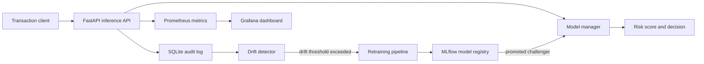
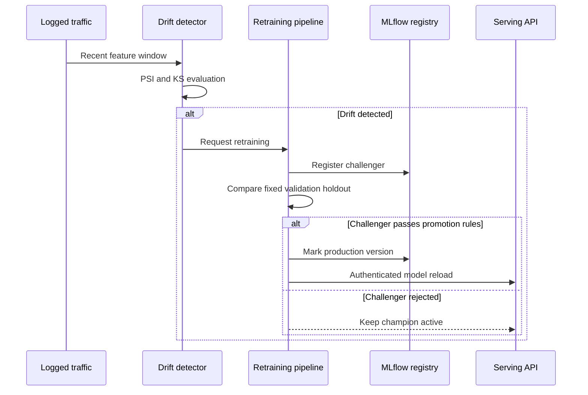
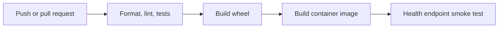

# DriftGuard

[](https://github.com/AbdelrahmanAboegela/driftguard-mlops/actions/workflows/ci.yml)

DriftGuard is a reference MLOps system for fraud-risk scoring. It combines a FastAPI inference service, statistical data-drift monitoring, champion/challenger model evaluation, MLflow tracking, and Prometheus/Grafana observability.

## Architecture



## Prerequisites

- Python 3.10 or later (the CI pipeline uses Python 3.11)
- Docker and Docker Compose for the full local stack

## Quick start

```bash
git clone https://github.com/AbdelrahmanAboegela/driftguard-mlops.git
cd driftguard-mlops
python -m pip install ".[dev]"
python -m pytest -v
```

The repository includes a trained local model artifact for development and testing. To generate data and train a new baseline model:

```bash
python -m data.split_data
python -m training.train
```

Start the API:

```bash
uvicorn serving.app:app --host 0.0.0.0 --port 8000 --reload
```

Verify it in another terminal:

```bash
curl http://localhost:8000/health
```

Interactive API documentation is available at `http://localhost:8000/docs`.

## API guide

The service accepts the `Time`, `Amount`, and `V1` through `V28` numerical fields from the credit-card-fraud feature schema. `request_id` is optional; the API generates one when it is omitted.

| Endpoint | Method | Use |
| --- | --- | --- |
| `/health` | `GET` | Liveness and loaded-model status |
| `/predict` | `POST` | Score one transaction |
| `/predict/batch` | `POST` | Score a list of transactions |
| `/drift/status` | `GET` | Most recent drift evaluation summary |
| `/metrics` | `GET` | Prometheus metrics exposition |
| `/reload-model` | `POST` | Reload the active model; requires `x-api-key` |

Example single-transaction request:

```bash
curl --request POST http://localhost:8000/predict \
  --header "Content-Type: application/json" \
  --data '{
    "Time": 406.0,
    "Amount": 149.62,
    "V1": -2.31, "V2": 1.95, "V3": -1.60, "V4": 3.99,
    "V5": -0.52, "V6": -1.42, "V7": -2.53, "V8": 1.39,
    "V9": -2.77, "V10": -2.77, "V11": 3.20, "V12": -2.89,
    "V13": -0.59, "V14": -4.28, "V15": 0.38, "V16": -1.14,
    "V17": -2.83, "V18": -0.01, "V19": 0.41, "V20": 0.12,
    "V21": 0.51, "V22": -0.03, "V23": -0.46, "V24": 0.32,
    "V25": 0.04, "V26": 0.17, "V27": 0.26, "V28": -0.14
  }'
```

Responses include the fraud probability, binary decision, model version, threshold used, request identifier, and inference latency. Invalid or incomplete input returns FastAPI's standard `422` validation response.

## Configuration

Copy `.env.example` to `.env` and set values appropriate for your environment. In particular, replace the development-only `ADMIN_API_KEY` before exposing the service. `ALLOWED_ORIGINS` should be an explicit, comma-separated list of browser origins in production.

| Variable | Purpose | Default |
| --- | --- | --- |
| `ADMIN_API_KEY` | Authorizes `POST /reload-model` | `dev-admin-key` |
| `MLFLOW_TRACKING_URI` | MLflow tracking and registry backend | `sqlite:///mlflow.db` |
| `MLFLOW_MODEL_NAME` | Registered model name | `driftguard-fraud` |
| `SERVING_URL` | URL used by orchestration callbacks | `http://localhost:8000` |
| `ALLOWED_ORIGINS` | Comma-separated CORS allowlist | `*` |

## Full local stack

```bash
docker compose up --build
```

| Service | Address |
| --- | --- |
| Inference API | `http://localhost:8000` |
| API documentation | `http://localhost:8000/docs` |
| MLflow | `http://localhost:5000` |
| Prometheus | `http://localhost:9090` |
| Grafana | `http://localhost:3000` |

For local-only use, Grafana is provisioned with `admin` / `admin`. Set a unique `GF_SECURITY_ADMIN_PASSWORD` through your Compose environment before deployment.

Stop the stack with `docker compose down`.

## Drift monitoring and retraining

DriftGuard compares recent logged traffic against the temporal training baseline. It evaluates Population Stability Index (PSI) and a Kolmogorov-Smirnov test per feature.

| Signal | Interpretation |
| --- | --- |
| PSI below `0.10` | Stable |
| PSI from `0.10` to below `0.25` | Monitor |
| PSI `0.25` or higher | Significant feature drift |

The detector triggers when at least 20% of evaluated features are drifted or any feature has PSI of at least `0.25`. It requires at least 20 recent records. Evaluation writes `reports/drift_summary.json` and, when Evidently can render it, `reports/drift_report.html`.



Run an end-to-end local exercise with:

```bash
python -m scripts.simulate_production
```

This command may generate source data, reports, MLflow state, and new local model artifacts. Run it only in a disposable local development environment unless those outputs are intentionally managed.

## Imbalanced-learning and evaluation policy

Fraud labels are highly imbalanced, so raw accuracy is not a model-selection metric. The pipeline reports PR-AUC, precision, recall, specificity, F1, G-mean, false-negative rate, false-positive rate, expected cost, and cost per transaction.

By default it uses cost-sensitive XGBoost weighting derived from the training-fold class ratio. The training API also supports optional resampling methods: `smote`, `adasyn`, `smoteenn`, and `smotetomek`. Resampling is performed **only after feature transformation on the training fold**; validation, production replay, and final test records are never resampled.

The temporal split is 65% training, 15% validation, 10% production replay, and 10% final test. The validation window selects the operating threshold, while the final test period is held untouched until after selection. Training saves post-selection test metrics and 95% bootstrap confidence intervals for PR-AUC, F1, recall, specificity, G-mean, and expected cost in the model metadata.

The default cost policy treats one false negative as 25 times the cost of one false positive. Adjust `false_positive_cost` and `false_negative_cost` in `train_baseline_model` or `train_challenger` to match investigation and fraud-loss economics.

### Reproducible strategy benchmark

Run every supported strategy against one fixed temporal test period:

```bash
python -m scripts.compare_imbalance_strategies --samples 120000 --seed 42
```

The following measured run used 120,000 deterministic synthetic transactions (0.1717% fraud), a 65%/15%/10%/10% temporal split, 78,000 pre-resampling training rows, 12,000 untouched test rows, 27 test fraud cases, 100 XGBoost estimators, and a 25:1 false-negative:false-positive cost ratio.

| Strategy | Train rows | Threshold | PR-AUC | F1 | Recall | Specificity | G-mean (95% CI) | FN / FP | Expected cost | Runtime (s) |
| --- | ---: | ---: | ---: | ---: | ---: | --- | --- | ---: | ---: | ---: |
| Cost-sensitive weight only | 78,000 | 0.999822 | 1.0000 | 0.9615 | 0.9259 | 1.0000 | 0.9623 (0.9044–1.0000) | 2 / 0 | 50 | 2.72 |
| SMOTE | 155,736 | 0.999786 | 1.0000 | 0.9615 | 0.9259 | 1.0000 | 0.9623 (0.8885–1.0000) | 2 / 0 | 50 | 6.65 |
| ADASYN | 155,736 | 0.926126 | 1.0000 | 1.0000 | 1.0000 | 1.0000 | 1.0000 (1.0000–1.0000) | 0 / 0 | 0 | 3.47 |
| SMOTEENN | 155,734 | 0.999795 | 1.0000 | 0.9615 | 0.9259 | 1.0000 | 0.9623 (0.8885–1.0000) | 2 / 0 | 50 | 34.47 |
| SMOTETomek | 155,736 | 0.999786 | 1.0000 | 0.9615 | 0.9259 | 1.0000 | 0.9623 (0.8885–1.0000) | 2 / 0 | 50 | 47.45 |

The benchmark CSV is written to `reports/imbalance_benchmark.csv`. Its perfect PR-AUC scores reflect the deliberately separable synthetic fraud generator and should **not** be treated as a production-performance claim. Repeat this comparison on a representative, labelled production dataset before selecting a resampling strategy. The final model decision should consider the confidence intervals and cost impact, not a single point estimate.

## Development workflow

```bash
python -m ruff format .
python -m ruff check .
python -m pytest -v
python -m build --wheel
```

The GitHub Actions workflow applies the same checks, then builds the container and waits for the `/health` endpoint to become available.



## Troubleshooting

| Symptom | Check |
| --- | --- |
| API health is `degraded` | Confirm `training/artifacts/champion_model.joblib` and `preprocessor.joblib` exist, then inspect API logs. |
| Data commands fail writing Parquet | Reinstall dependencies with `python -m pip install ".[dev]"`; `pyarrow` is required. |
| Model reload returns `401` | Send the `x-api-key` header matching `ADMIN_API_KEY`. |
| No drift is reported | At least 20 logged records are required; inspect `/drift/status` and `reports/drift_summary.json`. |
| Compose service cannot connect to MLflow | Check `docker compose ps` and use the internal `http://mlflow:5000` URI from containers. |

## Project layout

| Path | Responsibility |
| --- | --- |
| `serving/` | API schemas, model lifecycle, prediction logging, and metrics |
| `training/` | Feature engineering, training, and evaluation |
| `monitoring/` | PSI/KS drift evaluation and drift injection |
| `orchestration/` | Challenger training, promotion, rollback, and Airflow DAG |
| `data/` | Dataset retrieval and temporal splitting |
| `tests/` | Unit and API integration coverage |

## Operational notes

- The `POST /reload-model` endpoint requires the `x-api-key` header.
- The data download falls back to a synthetic fraud dataset when Kaggle credentials are unavailable.
- Run the simulation as `python -m scripts.simulate_production`. It creates local data, runs drift evaluation, and may update local model artifacts and reports.

## License

MIT License.
